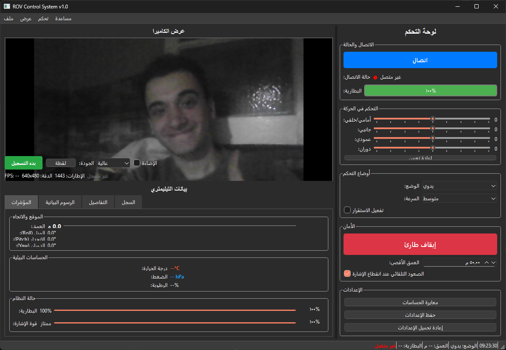
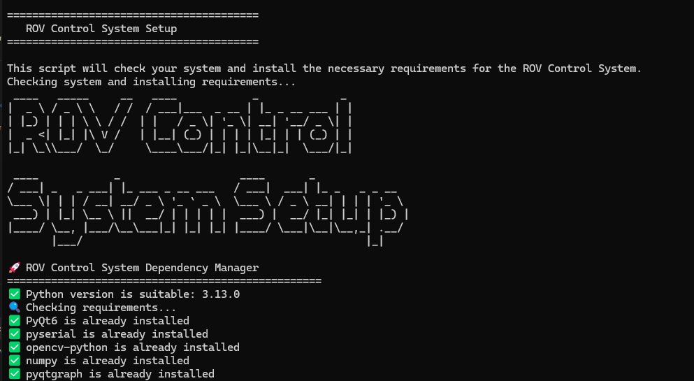

# ROV Control System v1.0

An advanced and integrated control system for Remotely Operated Vehicles (ROV) developed using Python and a modern GUI interface.
<p align="center">
    
    
</p>

## 🚀 Quick Start

### Download Ready-to-Use Executable

1. Go to [Releases](https://github.com/MUHAMMEDHAFEEZ/ROV_CONTROL_GUI/releases)
2. Download the latest `ROV_Control_GUI.zip`
3. Extract and run `ROV_Control_GUI.exe`
4. Or use `install.bat` for system-wide installation

### System Requirements

- Windows 10/11 (64-bit)
- Minimum 4GB RAM
- 500MB free disk space
- USB port for joystick (optional)
- Network connection for ROV

## 🎯 Main Features

### 🎮 Advanced Control

* **Manual Control**: Direct control of motors via joystick or control panel
* **Stabilization Mode**: Automatic stabilization using IMU data
* **Position Control**: Precise positioning using PID Controller
* **Multiple Speed Modes**: Slow, Medium, Fast

### 📊 Comprehensive Monitoring

* **Live Camera Feed**: Real-time video with recording capability
* **Telemetry Data**: Comprehensive display of all sensor data
* **Interactive Graphs**: Track data over time
* **Smart Alerts**: Warnings for critical conditions

### 🛡️ Safety Systems

* **Emergency Stop**: Instant shutdown of all motors
* **Depth Limits**: Prevent exceeding maximum depth
* **Auto Surface**: Surfacing when signal is lost
* **Battery Monitoring**: Alerts on low battery level

### 🔧 Advanced Management

* **Sensor Calibration**: Automatic and manual sensor calibration
* **Logging System**: Comprehensive logging of events and errors
* **Settings Saving**: Save and load custom settings
* **Data Export**: Export telemetry data in CSV format

## 🏗️ Project Structure

```md
rov_project/
│
├── gui/                        # GUI interface
│   ├── main_window.py         # Main window
│   ├── camera_feed.py         # Camera view
│   ├── control_panel.py       # Control panel
│   └── telemetry_display.py   # Telemetry display
│
├── controller/                # Motor and motion control
│   ├── rov_controller.py      # Main controller
│   ├── motors.py              # Motor management
│   └── joystick_input.py      # Joystick support
│
├── communication/             # ROV communication
│   ├── serial_comm.py         # Serial communication
│   ├── network_comm.py        # Network communication
│   └── packet_handler.py      # Packet processing
│
├── sensors/                   # Sensor data processing
│   ├── imu.py                 # Inertial Measurement Unit
│   ├── pressure_sensor.py     # Pressure & depth sensor
│   └── temperature_sensor.py  # Temperature sensor
│
├── utils/                     # Helper utilities
│   ├── logger.py              # Logging system
│   ├── config.py              # Settings management
│   └── calibration.py         # Sensor calibration
│
├── assets/                    # Assets
│   ├── icons/                 # Icons
│   ├── images/                # Images
│   └── sounds/                # Sounds
│
├── main.py                    # Main project entry point
├── requirements.txt           # Required libraries
└── config.ini                 # Configuration file
```

## 🚀 Quick Start

### 1. Install Requirements

```bash
pip install -r requirements.txt
```

### 2. Run the App

```bash
python main.py
```

### 3. Setup Communication

1. Choose communication type (Serial or Network) from settings
2. Select the port or IP address
3. Click "Connect"

## 📋 Requirements

### Core Libraries

* `PyQt6` - GUI Interface
* `pyserial` - Serial Communication
* `opencv-python` - Video Processing
* `numpy` - Mathematical Operations
* `pyqtgraph` - Graph Plotting

### Additional Libraries

* `pygame` - Joystick Support
* `pyyaml` - YAML File Parsing
* `configparser` - Configuration Management

### Hardware Requirements

* USB Camera (optional)
* Joystick or Gamepad (optional)
* Serial Port or Network Connection to ROV

## ⚙️ Settings

### Communication Settings

```ini
[COMMUNICATION]
serial_port = COM3
baud_rate = 9600
use_network = False
network_ip = 192.168.1.100
network_port = 8080
```

### Control Settings

```ini
[CONTROL]
max_speed = 100
use_pid = True
pid_kp = 1.0
pid_ki = 0.1
pid_kd = 0.05
```

### Safety Settings

```ini
[SAFETY]
max_depth = 50
auto_surface = True
battery_warning = 20
```

## 🎮 Controls

### Keyboard

* `Space` - Emergency Stop
* `F11` - Fullscreen
* `Ctrl+C` - Connect/Disconnect
* `Ctrl+Q` - Exit

### Joystick (Xbox Controller)

* **Left Stick**: Forward/Backward and Side Movement
* **Right Stick**: Vertical and Rotational Movement
* **Buttons**: Specialized Functions (Light, Record, etc.)

## 🔧 Calibration

### IMU Calibration

1. Place the ROV in a stable position
2. Go to “Control” > “Sensor Calibration”
3. Follow on-screen instructions

### Motor Calibration

1. Ensure the ROV is in water
2. Run motor calibration
3. Test all directions

## 📊 Data Monitoring

### Live Telemetry

* **Position**: Coordinates X, Y, Z
* **Orientation**: Roll, Pitch, Yaw
* **Sensors**: Temperature, Pressure, Humidity
* **System**: Battery, Signal

### Graphs

* Depth over Time
* Temperature Chart
* Orientation and Tilt Chart

## 🛠️ Maintenance & Troubleshooting

### Common Issues

#### Cannot Connect to ROV

1. Check connection cable
2. Verify port settings
3. Ensure ROV is powered on

#### Camera Not Working

1. Check USB camera connection
2. Verify camera drivers
3. Try another camera

#### Joystick Not Responding

1. Check joystick connection
2. Calibrate joystick
3. Ensure joystick input is enabled

### Log Files

* Logs are saved in the `logs/` folder
* Each session has a separate log file
* Logs include errors and important events

## 🔄 Development & Updates

### Adding New Features

1. Create a new branch for the feature
2. Develop and test
3. Submit a merge request

### Code Structure

* Each module has a specific purpose
* Comments are written in Arabic
* Follows Python PEP 8 standards

## 🧪 First-Time Setup

To simplify first-time setup and ensure all dependencies are installed:

1. Open `run.bat` to initialize the system.

**`run.bat` contents:**

```bat
@echo off
chcp 65001 >nul
title ROV Control System Setup

echo.
echo ========================================
echo    ROV Control System Setup
echo ========================================
echo.

echo This script will check your system and install the necessary requirements for the ROV Control System.
echo Checking system and installing requirements...
python setup.py

echo.
echo Do you want to start the app now? (y/n)
set /p choice="Choose (y/n): "

if /i "%choice%"=="y" (
    echo.
    echo Start ROV Control System...
    python main.py
) else (
    echo.
    echo you can start the app later by running:
    echo python main.py
)

echo.
echo Click any key to exit...
pause >nul
```

> You can double-click `run.bat` to get started with setup and launching the app.

## 📝 License

This project is licensed under the MIT License - see the LICENSE file for details.

## 📞 Support & Contact

For technical support or inquiries:

* Create an issue in the repository
* Contact the team
* Check the documentation
